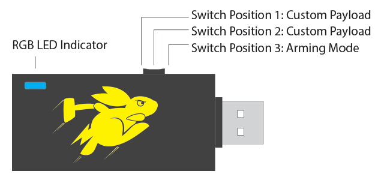
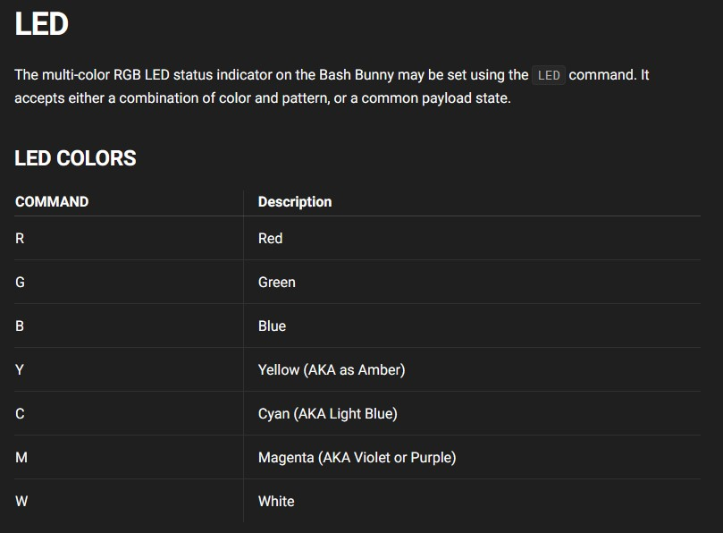
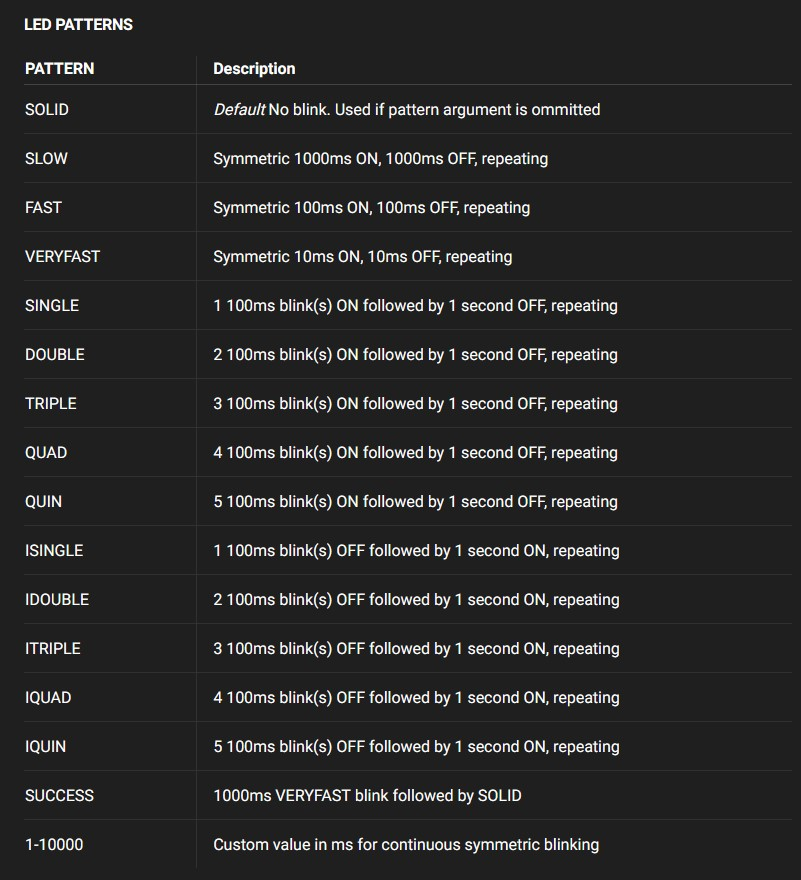
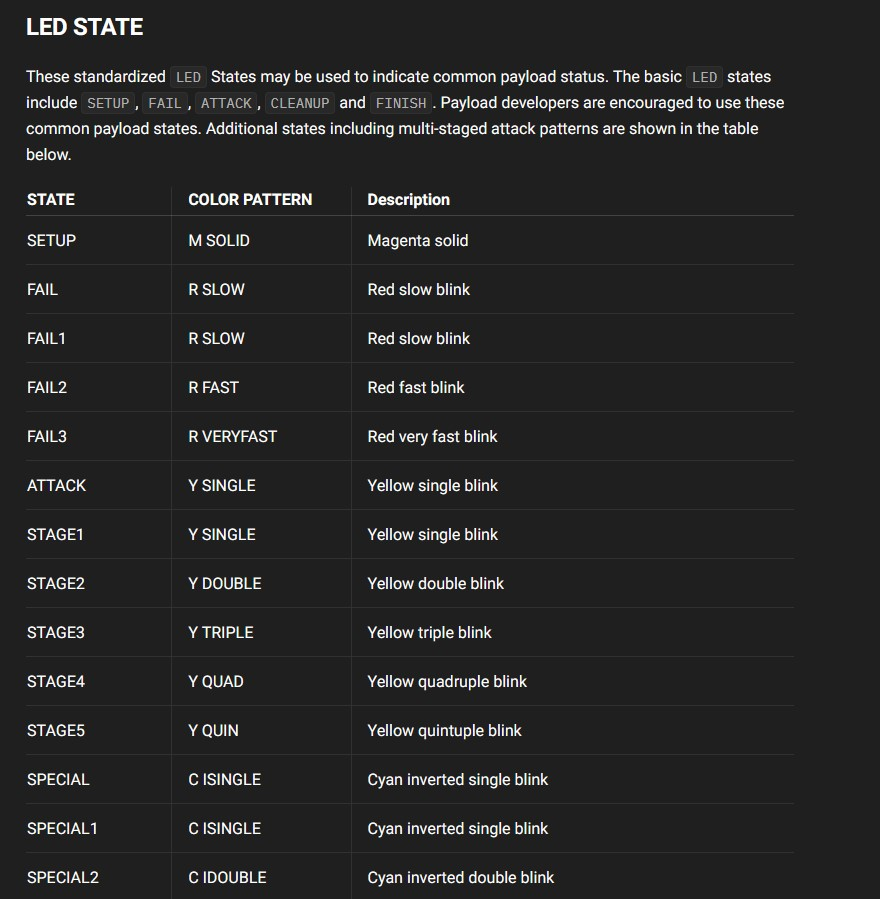

# EK Bash Bunny:

Christian Parushev: 12.06.2024

## Einführung:

Als individuelle EK wir hier der Bash Bunny von Hak5 dokumentiert und ausführlich erklärt.

## Projektbeschreibung:

Der Bash Bunny ist, ähnlich wie der USB Rubber Ducky ein Keystroke Injection Tool. er sieht aus wie ein gewöhnlicher USB-Stick, wird allerdings von Computern als Tastatur UND (zusätzlich zum Rubber Ducky) Wlan-Adapter wahrgenommen. So können vorprogrammierte Tastatuseinschläge (in Payloads/Skripten) bzw. verschiedenste Netzwerkattacken durchgeführt werden.

## Arbeitsschritte/Erklärung:

### Aufbau:

Der Bash Bunny ist eigentlich nur ein kleiner Linux-Computer (ähnlich wie ein Raspberry Pi) mit einem USB-Stecker. Wie in der unteren Abbildung zu sehen ist, hat er einen Schalter mit 3 Modi und eine LED.



### LED:

Die LED zeigt den Status des Bunnies an. Einerseits gibt es default Farben und "Abfolgen", andererseits kann man im eigenen Payload definieren, nach welchem Schritt in welcher Farbe die LED sein soll. Mit dem Befehl `LED` und anschließend einer Farbe/Abfolge, kann man die LED steuern:



Außerdem gibt es noch Patterns:



Und ganze States:



**Beispiele:**

`LED FAIL`

`LED R FAST`

### Schalter:

Wie schon erwähnt hat der Schalter 3 Modi:

- **Arming-Mode:** Hier wird der Bunny als normales Speichermedium erkannt. In dem Modus lassen sich die Payloads konfigurieren, Tools einbinden, Dateien eingefügt werden...

- **Attackmode 1:** Die mittlere Position des Schalters ist zum Ausführen eines Payloads da.

- **Attackmode 2:** der dritte Modus ist ein zweiter Platz für ein Payload.


## Syntax:

Der Bash Bunny wird, wie im Namen mit Bash und der Programmiersprache Ducky Script programmiert. Da ich Ducky Script schon ausführlich in meiner [EK-Dokumentation](https://github.com/chris-pa21/EK_parushev_rubberducky) über den Rubber Ducky erklärt habe, werde ich nicht genauer darauf eingehen. Die einzige Sonderheit hier ist, dass vor dem Befehl `Q` bzw. `QUACK` hingeschrieben/gekenneichnet werden muss, falls mit Duckyscript gearbeitet wird. Beispiel:

`Q STRINGLN Hello, World!`


## WLAN-Adapter Funktion:

Wie in der Einführung beschrieben kann sich der Bunny auch als Wlan-Adapter verstellen. So können auch Wlan-Attacken ausgeführt werden. Um diese Funktion zu nutzen, muss zusätzlich am Anfang zu `ATTACKMODE ...` (definiert den Attackiermodus, also Speichermedium, Tastatur...) `RNDIS_ETHERNET` für Windows und `ATTACKMODE ECM_ETHERNET` für Linux bzw. MacOS hinzugefügt werden.

Beispiel:

`ATTACKMODE Storage RNDIS_ETHERNET`

Nun kann man auf die IP-Adresse zugreifen und verschiedenste WiFi-Attacken ausfüren. 


Außerdem kann auch der Bunny im Gegensatz zum Ducky auf den Hostname, IP, Switchposition (Auf welcher Position der Schalter ist) und Host-IP zugreifen. Eine weitere Möglichkeit ist das Installieren von zusätzlichen Tools wie Nmap, Metasploit...

Dazu muss die zugehörige .deb-Datei in den Tools-Ordner des Bunnies gelegt und der Bunny neu gebooted werden.


## Beispielskript 1:

Folgendes Skript speichert die IP-Adresse und den Hostname des Opfers in einer Datei, die in Loots/[Hostname des Opfers] liegt.

```bash
# Author Christian Parushev
# This script saves Hostname and IP in a File

LED SETUP
Q DELAY 500
# Define ATTACKMODE
ATTACKMODE HID RNDIS_ETHERNET
GET TARGET_HOSTNAME
GET TARGET_IP
HOST=${TARGET_HOSTNAME}
IP=${TARGET_IP}
DIR=/root/udisk/loot/skript1/$HOST


# Create directory for the saved file
mkdir -p $DIR

LED ATTACK
echo "Hostname: $HOST" >> $DIR/result.txt
Q DELAY 100
echo "IP: $IP" >> $DIR/result.txt

LED FINISH
```

Nun muss man es noch im Ordner speichern:


## Beispielskript 2:

Das nächste Skript führt einen Nmap-Scan aus und speichert den Scan in eine Datei.  

```bash
# Author Christian Parushev
# This script Scans the Target with NMAP and saves te scan in a file

LED SETUP
Q DELAY 500
# Define ATTACKMODE
ATTACKMODE HID RNDIS_ETHERNET
GET TARGET_HOSTNAME
GET TARGET_IP
HOST=${TARGET_HOSTNAME}
IP=${TARGET_IP}
DIR=/root/udisk/loot/skript2/$HOST


# Create directory for the saved file
mkdir -p $DIR

LED ATTACK
nmap -sC -sV $IP >> $LOOTDIR/nmap.txt

LED FINISH
```


